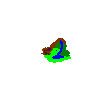

RustGame
===

RustGame is an engine for a console-based survival/adventure game, written in Rust. It has an Entity-Component architecture, and uses an event-based model for client/server communication.

Setup
---

The repository is set up so that the game can be run and compiled using `cargo`.

So far, the game has very little content. The level is loaded from a file in the `data` directory, which contains an image whose pixels code for the level content.

The player moves using the WASD keys. In order to attack, the player holds shift while pressing the WASD key in the direction of attack. The player can pick up items from the ground by walking over them. Entrances into caves are marked by an `O`.